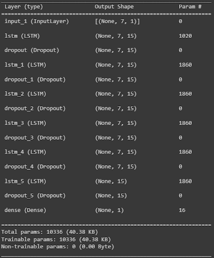
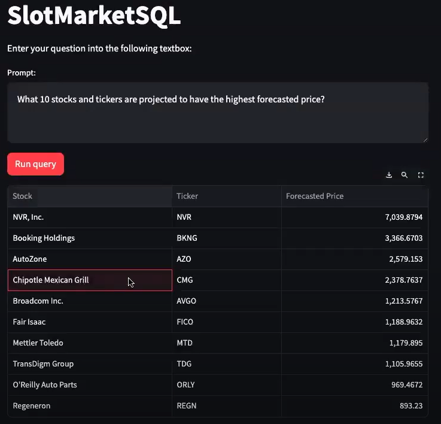
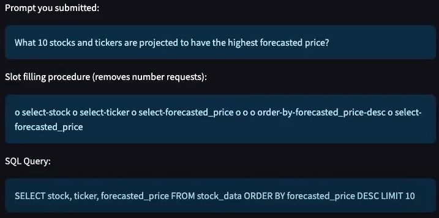
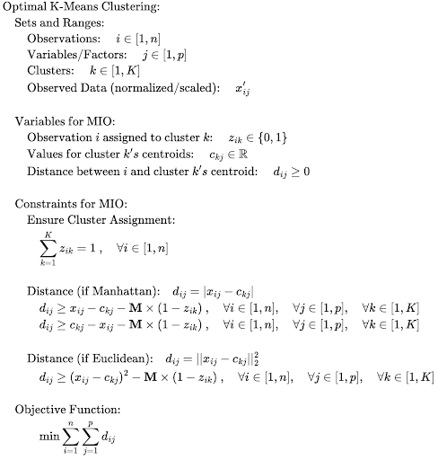
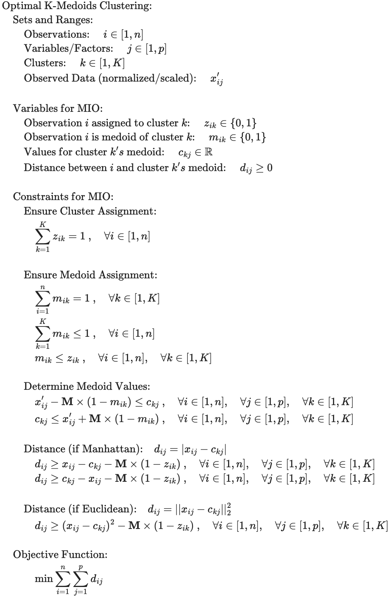
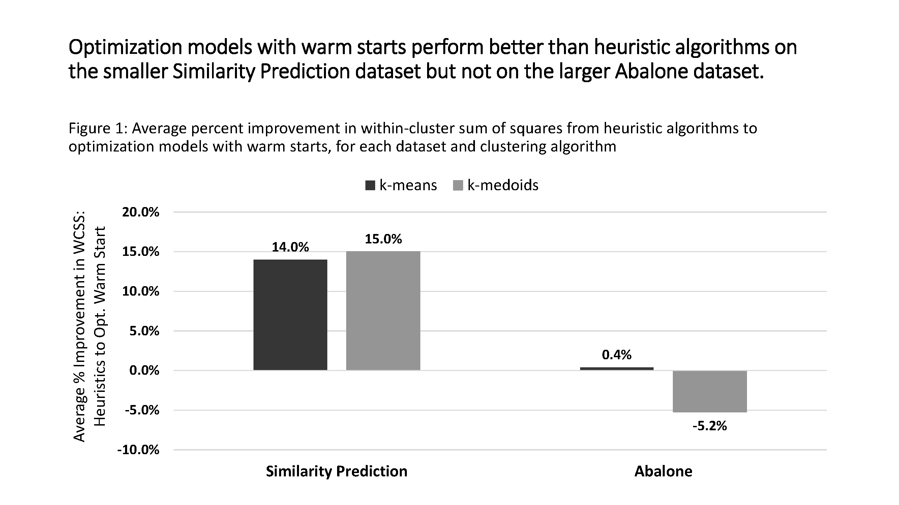

# Tanner Street's Portfolio
## Introduction
Hello! My name is Tanner Street, and I am currently a Master of Business Analytics student at MIT aspiring to be a data scientist or machine learning engineer. This portfolio contains two projects that I am especially proud of and reflect a variety of relevant skills. I also included some brief information on several other projects at the bottom of this document. You can contact me via [LinkedIn](https://www.linkedin.com/in/tannerstreet/) or email at street24@mit.edu. 

# Project 1: SlotMarketSQL - S&P 500 Forecasting with LSTMs and Transformer-Based Chat Interface

## Overview
* Final project for Course 15.773: Hands-On Deep Learning at MIT
* I am very interested in time-series forecasting and have done several projects involving more traditional methods such as SARIMA. My goal was to not only understand these advanced techniques but also develop a valuable tool for end-users.
* Collaborated with Zack Horton, Virginia Maguire, and Yutong Zhang
* See [report](https://github.com/tstreet24/Street_Portfolio/blob/main/reports/HODL%20Project%20Report%20-%20Group%20A26.pdf), [presentation](https://github.com/tstreet24/Street_Portfolio/blob/main/presentations/HODL%20Final%20Presentation%20-%20A26.pdf), and [Colab](https://github.com/tstreet24/Street_Portfolio/blob/main/SlotMarketSQL.ipynb)

## Situation
* The ability to leverage historical data and build intelligent models for future stock price and risk predictions is vital to day traders’ decision-making process as well as portfolio management. However, many traders do not have the skill set to create these models or easily interface with crucial data. 

## Task
* Forecast daily closing stock prices and volatilities using deep learning models and create a chatbot that allows a day trader to easily access information by querying the interface.

## Data
* Closing prices of S&P 500 stocks over two years (from 2022-01-22 to 2024-01-21), procured from Yahoo Finance using the API.
* Manually created and labeled a diverse set of user queries, using ChatGPT for question permutations.

## Tools and Methods
* **Tools:** Python (TensorFlow, Keras, arch, Pandas, NumPy)
* **Methods:** LSTMs, GARCH, Transformers, Walk forward validation, Slot-Filling, Text-to-SQL Parsing

## Pre-Processing
* Min-max normalization of closing stock prices
* Calculating log returns for volatility modeling

## Actions
* Developed an LSTM model to forecast next-day stock prices, optimizing parameters such as epochs, input sequence length, LSTM units, dropout rate, and LSTM stacks through various experiments using walk-forward validation for evaluation.
* Implemented a GARCH model to predict stock volatility based on past variances and squared residuals.
* Created a Slot-Filling mechanism with transformers to allow users to generate custom SQL queries for stock market analytics.
* Packaged the models and chatbot interface into a Streamlit web application for user interaction.

## Results
* Identified the optimal LSTM architecture to have 6 LSTM stacks with 15 LSTM units per stack, a 15% dropout rate, and a 7-day input sequence length.

  
* The baseline model, which predicts the prior day's price, generally outperformed the LSTM model.
* Slot-filling accuracy reached ~93% in test sets, demonstrating the effectiveness of the chatbot in parsing and responding to user queries.
* The web application runs effectively and quickly.

  
  
  

## Future Work
* Incorporate exogenous variables, such as market sentiment indicators, economic factors, and other stock movements, to improve LSTM forecasting accuracy.
* Customize parameters for individual stocks, acknowledging that each stock may respond differently to various model configurations.
* Fine-tune and evaluate the GARCH models for more accurate volatility forecasts.
* Include advanced filtering options and the ability to handle a broader array of query types, potentially through more extensive training datasets or leveraging pre-trained models.
* Investigate the use of LLMs for a more robust approach to generating SQL queries, aiming to handle a wider range of user queries.
* Implement mechanisms for automatic daily updates of data and model retraining to ensure the platform remains up-to-date and scalable.

# Project 2: Optimal K-Means and K-Medoids Clustering
## Overview
* Final project for Course 15.095: Machine Learning Under a Modern Optimization Lens at MIT
* This project is particularly interesting to me since it pertains to the intersection of machine learning and optimization. Indeed, the MBAn curriculum at MIT has convinced me of the power and importance of optimization, so my partner and I wanted to explore new avenues for this intersection.
* Collaborated with Zack Horton
* See [report](https://github.com/tstreet24/Street_Portfolio/blob/main/reports/15.095%20-%20Machine%20Learning%20Project%20Report.pdf), [presentation](https://github.com/tstreet24/Street_Portfolio/blob/main/presentations/15.095%20-%20Machine%20Learning%20Project%20Presentation%20(1).pdf), and [GitHub repository](https://github.com/zack-horton/ML-Project)

## Situation
- Clustering is typically performed using heuristic algorithms, so optimality is not guaranteed and results vary based on random initializations.

## Task
- Formulate mixed-integer optimization models for k-means and k-medoids cluster to address the shortcomings of heuristics while also remaining scalable and time efficient.

## Data
- **Abalone** from UC Irvine Machine Learning Repository (4177 observations, 9 features, mostly continuous)
- **Similarity Prediction** from UC Irvine Machine Learning Repository (100 observations, 17 features, mostly categorical)

## Tools and Methods
- **Tools:** Julia/JuMP
- **Methods:** Clustering, Mixed-integer modeling

## Pre-Processing
- Min-max normalization
- Standardization

## Actions
- Use mixed-integer modeling to perform k-means and k-medoids clustering.

  )

  
- Compare the optimization models to heuristic algorithms using metrics such as within-cluster sum of squares and silhouette scores.
- Evaluate the models on a diverse range of scenarios to find generalizable results by varying characteristics such as dataset, number of observations, number of clusters, usage of warm starts, etc.

## Results
- K-means and k-medoids clustering can be developed into optimization models using mixed-integer techniques. The models struggle to converge or improve the warm start solution as dataset size increases and when Euclidean distance is used.

  

## Future Work
- Find creative ways to transform fractional, binary equations into linear terms.
- Expand dataset variety to assess model scalability and effectiveness across different domains.

  
# Additional Projects
## 1. ARMA-GARCH Modeling for Financial Forecasting
- Final project for Course 15.072: Advanced Analytics Edge at MIT
- See [report](https://github.com/tstreet24/Street_Portfolio/blob/main/reports/15.072%20-%20Advanced%20Analytics%20Edge%20Report.pdf), [presentation](https://github.com/tstreet24/Street_Portfolio/blob/main/presentations/15.072%20-%20Advanced%20Analytics%20Edge%20Presentation%20(1).pdf), and [GitHub repository](https://github.com/Theo-Dawson/A_EDGE)

## 2. Optimization in Application: Green Epichlorohydrin Plant Production
- Final project for Course 15.093: Optimization Methods at MIT
- See [report](https://github.com/tstreet24/Street_Portfolio/blob/main/reports/15.093%20-%20Optimization%20Project%20Report.pdf), [presentation](https://github.com/tstreet24/Street_Portfolio/blob/main/presentations/15.093%20-%20Optimization%20Project%20Presentation%20(1).pdf), and [GitHub repository](https://github.com/zack-horton/Opt-Project)

